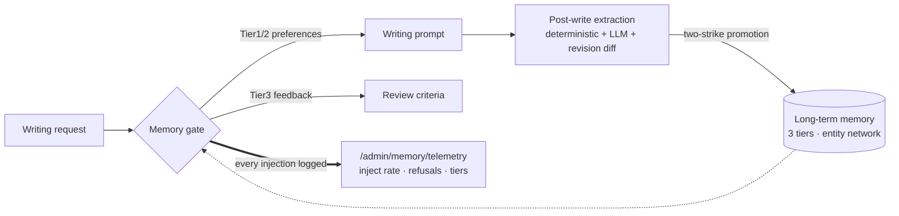

# LuminWrite OSS (笔润智谈)

<div align="center">


**Writing as engineering: observable, interruptible, iterable.**
A self-hosted AI writing workbench for Chinese content creation.
No "one-click magic" — retrieval → outline → drafting → self-review →
memory, with the creator in control at every decision point.


[中文](README.md) · [Quickstart](#-quickstart) · [Architecture](#-architecture) · [Docs](#-docs)

</div>

---

## ✨ Why LuminWrite

| | |
|---|---|
| 🧠 **Layered memory — and visible injection** | Three long-term tiers (hard preferences / behavior patterns / feedback) + an entity network; two-strike promotion, evidence-bounded recall and confidence decay built in; every injection lands in **injection telemetry** — "did the memory actually take effect" becomes a queryable fact |
| ⚙️ **Governed writing runtime as the backbone** | WritingContract → ExecutablePlan → typed Artifact → quality gates (Candidate/Accepted/Verified), fail-closed; REST commands + SSE runtime events with resumable streams; off/shadow/allowlist rollout with checkpoint recovery. The Harness core and editorial roles run as governed Executors — never a second source of truth |
| 📚 **Self-hosted RAG, zero external vector DB** | BM25 (ParadeDB) + vectors (pgvector) + RRF fusion + GraphRAG, all inside PostgreSQL; user materials always outrank retrieved content (P0) |
| 🧪 **Evaluation as a first-class citizen** | WABench contract-driven blind-eval/release pipeline + red-team suites; segmented feedback flows back into memory |
| 🔌 **Model-agnostic** | OpenAI-compatible `/chat/completions` (DeepSeek / SenseNova verified); hot-swap models and keys from the admin console (encrypted at rest) |

## 🗺 Architecture

```mermaid
flowchart LR
    U([Creator]) --> FE[React workspace<br/>Tiptap · Tailwind]
    FE -->|REST commands + SSE events| API[Go API<br/>chi · JWT · RBAC]
    subgraph RUN[Governed writing runtime]
        O["Orchestrator<br/>plan graph · checkpoints · recovery"]
        E["ExecutorAdapter<br/>Engine Step / Harness Core / Editorial Role"]
        O --> E
    end
    API --> RUN
    subgraph CAP[Shared capability layer]
        S[Multi-source search<br/>SearXNG (built-in) + pluggable search adapters]
        K[Local RAG<br/>BM25 + vector + GraphRAG]
        M[Layered memory<br/>gating · promotion · telemetry]
        V[Evaluation<br/>WABench · red team]
    end
    RUN --> CAP
    CAP --> DB[(PostgreSQL 17<br/>pgvector · ParadeDB)]
    CAP --> RD[(Redis 7)]
```

### Memory: from "stored" to "verifiably injected"



- **Write**: session-end auto-extraction of behavior patterns; "remember X" lands as a
  hard preference instantly (PII filter first);
- **Read**: multi-signal recall (semantic + keyword + recent), scene-tuned evidence
  boundaries, half-life confidence decay;
- **Observe**: `gate_inject / gate_refusal / explicit_capture / session_extract`
  events — the lesson of failures that survived releases quietly, turned into infrastructure;
- **Evidence ladder & minimal disclosure (WP6)**: `evidence_status` is graded at first
  observation (strong signal → verified, positive rating → supported, else none pending
  two-strike promotion); manual confirmation reaches verified directly; conflicted is
  never whitewashed by re-observation. Per-intent injection defaults to a cap of 8, and
  exhausted tool budgets return an idempotent hint instead of misleading copy (lesson
  from ablation variant D).

## 🎯 Problems solved

| Pain point | Symptom | LuminWrite's answer |
|---|---|---|
| **Unstable intent understanding** | Real needs, length and style constraints missed | Rule-first intent routing + low-confidence LLM fallback |
| **Black-box generation** | Retrieval, organization and drafting collapsed into one opaque call | Every step visible, pausable, resumable; memory injection verifiable via telemetry |
| **Lost control at key nodes** | No intervention at outline confirmation or style adjustment | Guided mode (outline before draft); governed runtime (contract first) |
| **Feedback goes nowhere** | Ratings never reach the next generation | Segmented feedback → three-tier memory → review criteria |

## 🚀 Quickstart

### Option 1: Quickstart compose (recommended, ~3 minutes)

Prebuilt images + built-in SearXNG search (**no search-provider API keys needed**):

```bash
git clone https://github.com/Echo-Smith/LuminWrite-OSS.git
cd LuminWrite-OSS
cp .env.docker.example .env.docker
vi .env.docker        # set at least DEEPSEEK_API_KEY
docker compose -f docker-compose.quickstart.yml up -d
```

Open `http://localhost:3002`, register, write. Images ship to GitHub Packages
(`ghcr.io/echo-smith/luminbuddy-v2-*`); `docker compose build` works too.

<details>
<summary>Option 2: main compose · Option 3: local dev · Verification · Production</summary>

```bash
# Main compose (build from source)
cp .env.docker.example .env.docker && vi .env.docker
docker compose up -d

# Local development
cd backend && cp .env.example .env && go run ./cmd/server/
cd frontend && npm ci && npm run dev

# Verification (recommended: make verify composite gate, from the repo root)
make verify

# or run the parts separately
cd backend && go test ./...
cd frontend && npm ci && npm test && npm run build
```

Production deployment (1Panel: image package / CLI / source, HTTPS reverse proxy,
multi-instance scaling) see [DEPLOY.md](DEPLOY.md); backup & restore see
[docs/ops-backup-restore.md](docs/ops-backup-restore.md).
</details>

## 🧩 Feature tour

- **Multi-mode execution**: unified scheduling by the governed runtime; the
  editorial DAG's research → write → review is relayed through governed Executors
  (context slotted per role); WebSocket retired from the main architecture;
- **Governed writing runtime**: WritingContract → ExecutablePlan → typed Artifact →
  quality gates (Candidate/Accepted/Verified), a versioned delivery protocol,
  fail-closed; REST commands + SSE runtime events, resumable on disconnect; default
  `shadow` (baseline authoritative + candidate shadow observation), off/shadow/allowlist
  rollout with checkpoint recovery ([docs/19](docs/19-governed-writing-runtime.md));
- **Three core writing flows**: long-form creation / multi-material synthesis /
  faithful rewrite — the flow picker at the writing entry threads through contract/plan
  construction (orchestration mode, evidence policy and node graph per flow,
  [docs/28](docs/28-wp4-pilot-scenarios.md));
- **Research-review path** (experimental): academic search (OpenAlex/CrossRef/
  Semantic Scholar) → evidence gate → outline gate → citation-verifiable draft,
  fail-closed end to end (off by default). The scholar operations execute
  in-process inside the Go backend (`backend/internal/scholar`); PDF parsing
  goes through the docreader sidecar — `SCHOLAR_WORKER_URL` is only the
  enablement signal, there is no separate worker service; context closure
  (WP1/WP2): the research evidence pack reaches downstream nodes (outline,
  draft, quality) through input references and transitive plan dependencies
  and lands in their ContextEnvelope, with evidence lines bound to the pack
  content hash;
- **AR-012 candidate evaluation** (experimental): external review sidecar produces
  isolated candidate drafts and mechanical comparison metrics (sidecar is a private
  component, not distributed here); an optional **different-vendor claim verifier**
  (`AR_REVIEW_VERIFY_*`) points at a verification model from a different vendor than
  the generation model and judges citation support sentence by sentence for every
  cited sentence of the manuscript (against its cited frozen abstracts; chunked calls
  with failed chunks degraded), report-only, persisted as the `claim-check/1`
  job artifact;
- **Passkey sign-in**: WebAuthn (Face ID / Touch ID / security keys). Registration
  records the authenticator's backup capability — iCloud/Google-password-manager
  passkeys sync across devices automatically; the personal center shows the
  "synced · cross-device" state and supports revocation;
- **Style system**: hot-swappable profiles + style builder (upload samples, extract
  automatically) + grayscale release; the repo ships **zero style content** by design
  ("engine open, content yours", [docs/04](docs/04-style-profile.md));
- **Admin console**: model config hot-reload (encrypted keys), models bound by
  purpose (generation / verification / embedding — where the different-vendor
  verifier is attached), MCP management, audit center, RBAC, injection telemetry
  ([docs/08](docs/08-admin-dashboard.md));
- **Evaluation center**: WABench datasets/candidates/blind eval/release + red-team
  suites ([docs/14](docs/14-wabench-v2-evaluation.md)).

## 🔧 Tech stack

| Layer | Technology |
|---|---|
| Backend | Go 1.25 · chi · SSE (net/http) · pgx/v5 · go-redis (deliberately lean deps) |
| Database | PostgreSQL 17 (ParadeDB image: pgvector + pg_bm25) · Redis 7 |
| Doc parsing | docreader sidecar (markitdown, TCP, ~150MB); PDF parsing now uses a bounded inline-byte protocol — the backend streams document bytes over `PARSEBYTES` (32 MiB cap) instead of staging a temp file path |
| Models | OpenAI-compatible `/chat/completions` (DeepSeek / SenseNova verified, [guide](docs/provider-configuration.md)) |
| Embedding | DashScope text-embedding-v3 (optional; graceful degradation when unset) |
| Frontend | React 19 · Vite 7 · TypeScript · Tailwind · Tiptap/ProseMirror · zustand |
| Research path | In-process Go scholar (`backend/internal/scholar`), PDF parsing via the docreader sidecar |

## 🔍 Search providers

| Provider | OSS edition | Notes |
|---|---|---|
| **SearXNG** | ✅ full | Self-hosted metasearch, zero API keys, built into the quickstart stack |
| Tavily / Zhihu / Tencent News / Weibo / Bing / AnySearch | stub | Public interfaces; wire your own via the [adapter guide](docs/search-provider-adapter.md) |

> **Edition boundary (OSS)**: The OSS edition ships no paid search provider
> implementations, no commercial credential variables and no commercial CLI. Paid
> search interfaces are exposed as stubs only and return `not-installed`; wire in a
> full implementation yourself via the [adapter guide](docs/search-provider-adapter.md)
> if you need one.

## ⚙️ Key configuration

Full annotated list: [.env.docker.example](.env.docker.example).

| Variable | Default | Purpose |
|---|---|---|
| `DEEPSEEK_BASE_URL` / `DEEPSEEK_API_KEY` / `DEEPSEEK_DEFAULT_MODEL` | — | LLM backend (OpenAI-compatible) |
| `SEARXNG_BASE_URL` | empty | The only out-of-the-box search source — strongly recommended |
| `WRITING_RUNTIME_MODE` | shadow | Governed runtime: off / shadow / allowlist (shadow = baseline authoritative + candidate shadow observation) |
| `RESEARCH_REVIEW_ENABLED` | false | Research-review path (enabling also requires `SCHOLAR_WORKER_URL` (any non-empty value, the enablement signal) and `SCHOLAR_WORKER_TOKEN` (required guard)) |
| `AR012_CANDIDATE_ENABLED` | false | AR-012 candidate evaluation endpoint (needs sidecar) |
| `AR_REVIEW_VERIFY_BASE_URL` / `_API_KEY` / `_MODEL` | empty | Different-vendor claim verifier: enabled once all three are set; **must be a different provider than the generation model** (report-only second line of defense) |
| `DASHSCOPE_API_KEY` | empty | Embedding (optional, degrades gracefully) |

> Day-to-day key changes go through the admin console (encrypted at rest, takes
> precedence over env vars). Keep `API_KEY_ENCRYPTION_KEY` stable once in use.

### Ablation benchmark runner (optional tooling)

`backend/cmd/run-ablation` + `backend/cmd/seed-ablation-cases`: 210 cases (72
multi-turn consistency), `--seed-runs-v2` idempotently creates versioned pending
runs. Credentials and endpoints are entirely environment-driven:

| Variable | Purpose |
|---|---|
| `LLM_API_KEY` | required (fail-closed), shared by execution and the blind-review judge |
| `LLM_BASE_URL` / `LLM_MODEL` | default xiaomi mimo endpoint / `mimo-v2.5`; any OpenAI-compatible endpoint works |
| `LLM_DISABLE_THINKING` | `1` = omit the `thinking` parameter (endpoints without the field 400 / return empty streams) |
| `LLM_TIMEOUT_SECONDS` | per-request timeout, default 120; use 600+ for long-form generation |
| `RUN_IDS` / `RUN_ID` | comma-separated multiple / single run |
| `ABLATION_CONCURRENCY` | per-run concurrency (default 16; lower for strict rate limits) |
| `ABLATION_TIMEOUT` | Go duration (default 2h) |
| `LLM_429_BACKOFF_BASE_MS` | 429/503 backoff base in ms (default 500; use 8000 for strict token-rate endpoints — 8s/16s/32s sequence) |
| `LLM_MIN_REQUEST_INTERVAL` | global minimum interval between requests (Go duration, e.g. `2s`; off by default) |

Memory seeding (the C/D candidates' memory injection needs preset content):
`go run ./cmd/seed-ablation-cases/ --seed-memories` (12 Tier-1 preferences mirroring the explicit-override/isolation cases, idempotent); `--wipe-memories` resets.

Pilot metrics collection: [backend/scripts/pilot-metrics.sql](backend/scripts/pilot-metrics.sql);
pilot onboarding: [docs/29](docs/29-pilot-user-onboarding.md).

## 🗺 Roadmap

- [x] Memory injection telemetry (live: `/admin/memory/telemetry`)
- [x] WebSocket retired from the main architecture (REST commands + SSE runtime events, resumable)
- [x] Governed runtime as the backbone (default shadow; Harness core / editorial roles governed)
- [x] History source-of-truth migration (governed documents/runs primary, `agent_traces` read-only)
- [x] Three-flow selection UI (long-form / multi-material / faithful rewrite)
- [x] 210-case ablation benchmark v2 (multi-turn consistency subset + real memory port)
- [ ] Allowlist promotion qualification verified end to end (policy → evidence → approval → gate)
- [ ] Editorial DAG on the unified memory contract (role-slotted injection)
- [ ] Community search adapters (full Tavily etc.)

## 📚 Docs

| Doc | Contents |
|---|---|
| [docs/01-architecture.md](docs/01-architecture.md) | Architecture overview |
| [docs/11-memory-system.md](docs/11-memory-system.md) | Layered memory |
| [docs/12-editorial-system.md](docs/12-editorial-system.md) | Editorial multi-agent |
| [docs/19-governed-writing-runtime.md](docs/19-governed-writing-runtime.md) | Governed runtime |
| [docs/search-provider-adapter.md](docs/search-provider-adapter.md) | Search adapter development |
| [docs/provider-configuration.md](docs/provider-configuration.md) | Provider switching |
| [docs/ops-backup-restore.md](docs/ops-backup-restore.md) | Backup & restore |
| [specs/](specs/) | research-review contracts & acceptance records |

## 📄 License

MIT © [Echo-Smith](https://github.com/Echo-Smith) — issues, PRs and stars welcome.
