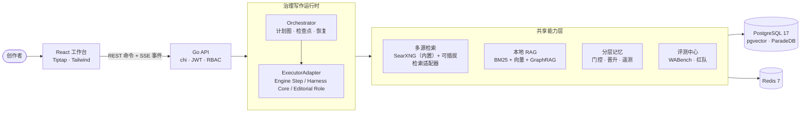
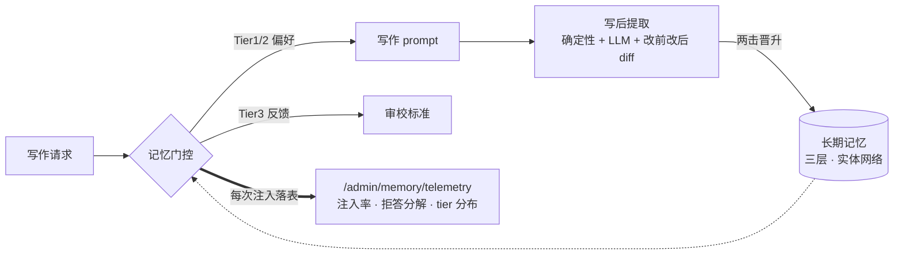

# 笔润智谈丨LuminWrite OSS

<div align="center">


**把写作拆成可观察、可干预、可迭代的工程流程** —— 面向中文内容创作的
自托管 AI 写作工作台。不追求「一键生成」的魔法：素材检索 → 提纲确认 →
风格化成稿 → 写后自检 → 记忆沉淀，关键决策始终由创作者掌控。


[English](README.en.md) · [快速开始](#-快速开始) · [架构](#-架构一览) · [文档](#-文档)

</div>

---

## ✨ 为什么是 LuminWrite

| | |
|---|---|
| 🧠 **分层记忆，且注入可见** | 硬偏好 / 行为模式 / 反馈三层长期记忆 + 实体网络；两击晋升、证据边界、置信衰减全部内置；每次注入都落**注入遥测**——「记忆到底生效没有」第一次成为可查询的事实 |
| ⚙️ **治理写作运行时是主干** | WritingContract → ExecutablePlan → typed Artifact → 质量门（Candidate/Accepted/Verified），fail-closed；REST 命令 + SSE 运行事件，断线可续传；off/shadow/allowlist 灰度与检查点恢复。Harness 执行核与编辑部角色作为受治理 Executor 接入，不构成平行事实源 |
| 📚 **自托管 RAG，零外部向量库** | PostgreSQL 单库内完成 BM25（ParadeDB）+ 向量（pgvector）+ RRF 融合 + GraphRAG；上传素材永远是你的最高优先级（P0），检索结果不得覆盖用户原始表达 |
| 🧪 **评测是一等公民** | WABench 契约驱动的盲评/发布流水线 + 红队评估集；分段反馈回流记忆，好坏都有去处 |
| 🔌 **模型无关** | OpenAI 兼容协议（DeepSeek / SenseNova 已验证）；Admin 后台热切换模型与密钥（加密入库），换 Key 不改文件 |

## 🗺 架构一览



### 记忆系统：从「写进去」到「看得见」



- **写入**：会话收尾自动提取行为模式；用户说「记住 X」即时落硬偏好（PII 过滤前置）；
- **读取**：语义 + 关键词 + 近期多信号召回，证据边界按场景松紧，置信度半衰期衰减；
- **观测**：`gate_inject / gate_refusal / explicit_capture / session_extract` 全事件遥测——
  静默失败存活多个版本的教训，固化成了基础设施；
- **证据阶梯与最小披露（WP6）**：`evidence_status` 首次观测即定级（强信号 verified /
  好评 supported / 其余 none 待两击晋升），人工确认直达 verified，conflicted 永不因
  重复观测洗白；单意图注入条数默认上限 8，工具预算耗尽返回幂等提示而非误导文案
  （消融 D 变体教训）。

## 🎯 解决了什么问题

| 痛点 | 具体表现 | LuminWrite 的方案 |
|---|---|---|
| **意图理解不稳定** | 真实需求、篇幅和风格约束没被准确捕捉 | 规则优先的意图路由 + 低置信度 LLM fallback |
| **生成过程黑盒** | 检索、组织、成稿被压进一次不可观察的生成 | 每一步可见、可暂停、可恢复；注入遥测让记忆生效可查证 |
| **关键节点失控** | 提纲确认、风格调整无法干预 | 引导模式：提纲确认后再成稿；治理运行时：合约先行 |
| **反馈无法沉淀** | 好坏反馈没有进入下一次生成 | 分段反馈 → 三层记忆 → 审校标准回流 |

## 🚀 快速开始

### 方式一：Quickstart Compose（推荐，3 分钟）

预构建镜像 + 内置 SearXNG 搜索（**无需任何搜索源 API key**）：

```bash
git clone https://github.com/Echo-Smith/LuminWrite-OSS.git
cd LuminWrite-OSS
cp .env.docker.example .env.docker
vi .env.docker        # 至少填写 DEEPSEEK_API_KEY
docker compose -f docker-compose.quickstart.yml up -d
```

打开 `http://localhost:3002`，注册即用。镜像发布自 GitHub Packages
（`ghcr.io/echo-smith/luminbuddy-v2-*`），也可 `docker compose build` 本地构建。

<details>
<summary>方式二：主 Compose（自构建）· 方式三：本地开发 · 验证 · 生产部署</summary>

```bash
# 主 Compose（自构建）
cp .env.docker.example .env.docker && vi .env.docker
docker compose up -d

# 本地开发
cd backend && cp .env.example .env && go run ./cmd/server/
cd frontend && npm ci && npm run dev

# 验证（推荐：make verify 本地综合门禁，仓库根目录运行）
make verify

# 或分别运行
cd backend && go test ./...
cd frontend && npm ci && npm test && npm run build
```

生产部署（1Panel：镜像包 / 命令行 / 源码三种方式、HTTPS 反代、多实例扩展）
见 [DEPLOY.md](DEPLOY.md)；备份与恢复见 [docs/ops-backup-restore.md](docs/ops-backup-restore.md)。
</details>

## 🧩 功能全景

- **多模式写作执行**：治理运行时统一调度；编辑部 DAG 的研究→写作→审校以受治理
  Executor 接力（上下文按角色分槽），WebSocket 已退出主架构；
- **治理型写作运行时**：WritingContract → ExecutablePlan → typed Artifact →
  质量门（Candidate/Accepted/Verified）的版本化交付协议，fail-closed；REST 命令 +
  SSE 运行事件，断线可续传；默认 `shadow`（baseline 权威 + candidate 影子观测），
  off/shadow/allowlist 灰度与检查点恢复（[docs/19](docs/19-governed-writing-runtime.md)）；
- **四大核心写作流程**：长文创作 / 多材料综合 / 忠实改写 / 深度研究——写作入口的
  流程选择器贯穿 contract/plan 构建（编排模式、证据策略、节点图按流程切换，
  [docs/28](docs/28-wp4-pilot-scenarios.md)）；
- **深度研究（research_review，第四流程，WP4 产品化）**：学术检索（OpenAlex/
  CrossRef/Semantic Scholar）→ 精读 → 证据门 → 提纲门 → 引用可校验成稿
  （`tpl_research_review_v1` 十节点模板），全链路 fail-closed；已从实验室开关
  升格为流程选择器一等选项。合同封存下沉后端：`research-contract-draft` 端点
  按 Go 结构体声明序构造并哈希 lcp/1.1 研究合同（draft v1 + confirmed v2），
  前端不再手写字段序 JSON；`RESEARCH_REVIEW_ENABLED` 代码默认开启，显式
  `false` 即部署级 kill switch（启动请求得到 503 `RESEARCH_UNAVAILABLE`，
  绝不静默降级）。scholar 运算在 backend Go 进程内执行
  （`backend/internal/scholar`），PDF 解析经
  docreader sidecar——`SCHOLAR_WORKER_URL` 仅作为启用信号，无独立 worker 服务；
  上下文闭环（WP1/WP2）：研究证据包随输入引用与传递计划依赖进入下游节点
  （提纲/成稿/质量）的 ContextEnvelope，证据行绑定包内容哈希；
- **深度研究试点授权（wp-pilot-launch）**：试点期按 subject 精确授权——migration 121
  `research_pilot_entitlements` 记录未过期 (subject, scope) 审批行（`expires_at`
  自动到期，`granted_by`/`reason` 审批留痕）；`research-contract-draft` 端点（403
  `RESEARCH_PILOT_REQUIRED`，重放请求同样受限）与治理运行时全部 8 个 research
  direct executor 双层共用同一 subject policy，授权查询失败一律 fail closed；draft
  草稿按 (document_id, input_hash) 持久化幂等重放（migration 121
  `research_contract_drafts`），跨秒重试 `contract_hash`/`confirmed_hash`
  逐字节稳定，并发首封由 `INSERT … ON CONFLICT DO NOTHING` 收敛到同一条封存；
- **AR-012 候选评估**（实验性）：外部综述 sidecar 产出隔离候选稿与机械对比指标
  （sidecar 为私有组件，不随本仓库分发）；宿主侧可启用**异源 Claim 复核**——
  `AR_REVIEW_VERIFY_*` 指向与生成模型不同供应商的验证模型，对成稿中带引用的
  句子逐句判定引用支撑性（对照所引冻结摘要；分块调用 + 失败分块降级，
  report-only 落作业产物 `claim-check/1`）；
- **Passkey 无密码登录**：WebAuthn（Face ID / Touch ID / 安全密钥）；注册时识别
  认证器备份能力——iCloud/Google 钥匙串类 Passkey 自动跨设备同步，个人中心
  展示「已同步 · 可跨设备」状态并支持吊销；
- **风格系统**：Profile 热插拔 + 风格构建器（上传范文自动提炼）+ 灰度发布；
  遵循「引擎开源、内容自有」——仓库不内置任何风格内容（[docs/04](docs/04-style-profile.md)）；
- **Admin 后台**：模型配置热更新（Key 加密入库）、按用途配置模型
  （内容生成 / 事实核查 / 向量检索，异源验证即在此绑定）、MCP 管理、审计中心、
  RBAC、注入遥测汇总（[docs/08](docs/08-admin-dashboard.md)）；
- **评测中心**：WABench 数据集/候选/盲评/发布 + 红队评估集（[docs/14](docs/14-wabench-v2-evaluation.md)）。

## 🔧 技术栈

| 层 | 技术 |
|---|---|
| 后端 | Go 1.25 · chi · SSE（net/http）· pgx/v5 · go-redis（依赖面刻意克制） |
| 数据库 | PostgreSQL 17（ParadeDB 镜像：pgvector + pg_bm25）· Redis 7 |
| 文档解析 | docreader sidecar（markitdown，TCP 协议，~150MB）；PDF 解析已升级为有界字节协议——backend 以 `PARSEBYTES` 内联传输文档字节（32 MiB 上限），不再落盘临时路径 |
| 模型 | OpenAI 兼容 `/chat/completions`（DeepSeek / SenseNova 已验证，[切换指南](docs/provider-configuration.md)） |
| Embedding | DashScope text-embedding-v3（可选，未配置自动降级） |
| 前端 | React 19 · Vite 7 · TypeScript · Tailwind · Tiptap/ProseMirror · zustand |
| 研究路径 | Go 进程内 scholar（`backend/internal/scholar`），PDF 解析经 docreader sidecar |

## 🔍 搜索源

| 源 | OSS 版 | 说明 |
|---|---|---|
| **SearXNG** | ✅ 完整实现 | 自托管元搜索，零 API key，quickstart 栈内置 |
| Tavily / 知乎 / 腾讯新闻 / 微博 / Bing / AnySearch | stub | 接口公开，可按[适配器指南](docs/search-provider-adapter.md)自行接入 |

> **版本边界（Edition boundary）**：OSS 版不包含任何付费搜索 Provider 实现、
> 商业凭证变量或商业 CLI。付费搜索接口仅以 stub 形式公开，调用即返回 `not-installed`，
> 可按[适配器指南](docs/search-provider-adapter.md)自行接入完整实现。

## ⚙️ 关键配置

完整清单见 [.env.docker.example](.env.docker.example)（含注释）。

| 环境变量 | 默认 | 说明 |
|---|---|---|
| `DEEPSEEK_BASE_URL` / `DEEPSEEK_API_KEY` / `DEEPSEEK_DEFAULT_MODEL` | — | LLM 后端（OpenAI 兼容） |
| `SEARXNG_BASE_URL` | 空 | 唯一开箱可用的搜索源，强烈建议配置 |
| `WRITING_RUNTIME_MODE` | shadow | 治理运行时：off / shadow / allowlist（shadow = baseline 权威 + candidate 影子观测） |
| `RESEARCH_REVIEW_ENABLED` | true | 深度研究（第四写作流程）总开关，代码默认开启；显式设为 `false` 即部署级 kill switch（启动请求得到 503 `RESEARCH_UNAVAILABLE`）。启用 scholar 运算需同时设置 `SCHOLAR_WORKER_URL`（任意非空值，启用信号）与 `SCHOLAR_WORKER_TOKEN`（必填守卫） |
| `AR012_CANDIDATE_ENABLED` | false | AR-012 候选评估端点（需 sidecar） |
| `AR_REVIEW_VERIFY_BASE_URL` / `_API_KEY` / `_MODEL` | 空 | 异源 Claim 复核：三项齐备即启用，**必须与生成模型不同供应商**（report-only 二道防线） |
| `DASHSCOPE_API_KEY` | 空 | Embedding（可选，未配置自动降级） |

> 日常换 Key 走 Admin 后台「模型配置」热更新（加密入库，优先于环境变量）。
> `API_KEY_ENCRYPTION_KEY` 一经使用必须保持稳定。

### 消融基准 runner（评测工具链，可选）

`backend/cmd/run-ablation` + `backend/cmd/seed-ablation-cases`：210 用例（含 72 个
多轮一致性用例），`--seed-runs-v2` 幂等创建版本化 pending run。凭据与端点全走环境变量：

| 环境变量 | 说明 |
|---|---|
| `LLM_API_KEY` | 必填（fail-closed），执行与盲评 judge 共用 |
| `LLM_BASE_URL` / `LLM_MODEL` | 默认 xiaomi mimo 端点 / `mimo-v2.5`，可指向任意 OpenAI 兼容端点 |
| `LLM_DISABLE_THINKING` | `1` = 不下发 `thinking` 参数（不支持该字段的端点会 400 / 空流） |
| `LLM_TIMEOUT_SECONDS` | 单请求整体超时，默认 120；长文生成建议 600+ |
| `RUN_IDS` / `RUN_ID` | 逗号分隔多个 / 单个 run |
| `ABLATION_CONCURRENCY` | 每 run 并发（默认 16，按端点限流调低） |
| `ABLATION_TIMEOUT` | Go duration（默认 2h） |
| `LLM_429_BACKOFF_BASE_MS` | 429/503 退避基数毫秒（默认 500；token 限流严格的端点建议 8000，序列 8s/16s/32s） |
| `LLM_MIN_REQUEST_INTERVAL` | 全局请求最小间隔（Go duration，如 `2s`；默认不整流） |

记忆种子（C/D 候选的记忆注入需要预置内容）：
`go run ./cmd/seed-ablation-cases/ --seed-memories`（12 条与显式覆盖/隔离用例呼应的 Tier1 偏好，幂等）；`--wipe-memories` 重置。

试点指标采集：[backend/scripts/pilot-metrics.sql](backend/scripts/pilot-metrics.sql)；
试点上手文档：[docs/29](docs/29-pilot-user-onboarding.md)。
r7 消融结论（WP6 后重跑）：D 变体硬失败 1.4%、工具调用循环清零；多轮一致性逐案配对为统计平局；B 维持试点晋级——详见[决策文档 r7 附录](docs/ablation-promotion-decision.md)。

## 🗺 Roadmap

- [x] 记忆注入遥测（已上线：`/admin/memory/telemetry`）
- [x] WebSocket 退出主架构（REST 命令 + SSE 运行事件，断线续传）
- [x] 治理运行时成为主干（默认 shadow；Harness 执行核 / 编辑部角色受治理接入）
- [x] 历史 SoT 迁移（governed documents/runs 为主，`agent_traces` 只读）
- [x] 四大核心写作流程选择 UI（长文创作 / 多材料综合 / 忠实改写 / 深度研究）
- [x] 210 用例消融基准 v2（多轮一致性子集 + 真实记忆端口接入）
- [ ] allowlist 晋升资格链线上验证（policy → evidence → approval → gate）
- [ ] 编辑部 DAG 生命周期进一步接入统一记忆契约（按角色分槽注入）
- [ ] 搜索源适配器社区共建（Tavily 等完整实现）

## 📚 文档

| 文档 | 内容 |
|---|---|
| [docs/01-architecture.md](docs/01-architecture.md) | 架构总览 |
| [docs/11-memory-system.md](docs/11-memory-system.md) | 分层记忆 |
| [docs/12-editorial-system.md](docs/12-editorial-system.md) | 编辑部多 Agent |
| [docs/19-governed-writing-runtime.md](docs/19-governed-writing-runtime.md) | 治理型运行时 |
| [docs/search-provider-adapter.md](docs/search-provider-adapter.md) | 搜索源适配器开发 |
| [docs/provider-configuration.md](docs/provider-configuration.md) | 模型提供方切换 |
| [docs/ops-backup-restore.md](docs/ops-backup-restore.md) | 备份与恢复 |
| [specs/](specs/) | research-review 契约与验收记录 |

## 📄 License

MIT © [Echo-Smith](https://github.com/Echo-Smith) —— 欢迎 Issue / PR / Star。
