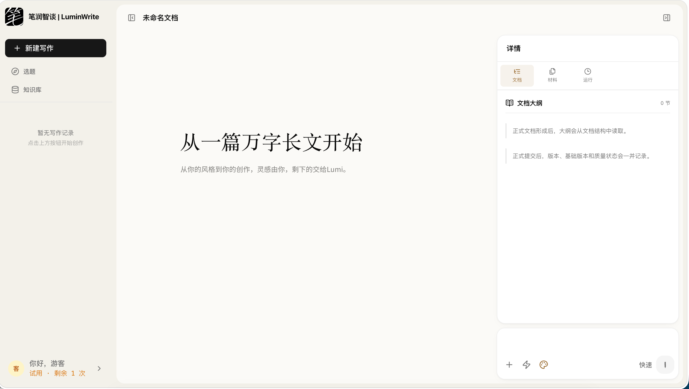
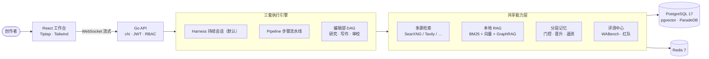
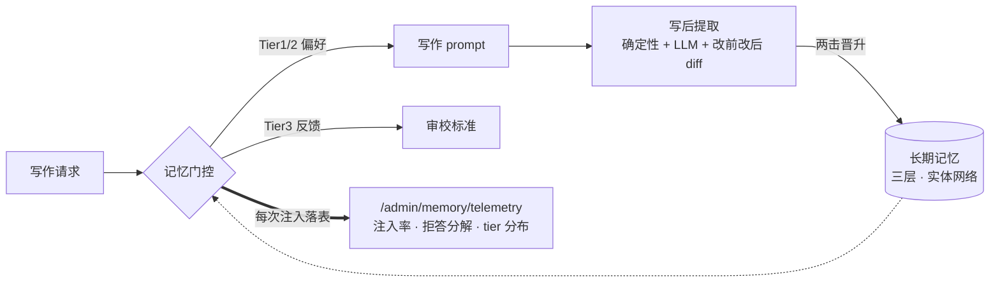

# 笔润智谈丨LuminWrite OSS

<div align="center">


**把写作拆成可观察、可干预、可迭代的工程流程** —— 面向中文内容创作的
自托管 AI 写作工作台。不追求「一键生成」的魔法：素材检索 → 提纲确认 →
风格化成稿 → 写后自检 → 记忆沉淀，关键决策始终由创作者掌控。



[English](README.en.md) · [快速开始](#-快速开始) · [架构](#-架构一览) · [文档](#-文档)

</div>

---

## ✨ 为什么是 LuminWrite

| | |
|---|---|
| 🧠 **分层记忆，且注入可见** | 硬偏好 / 行为模式 / 反馈三层长期记忆 + 实体网络；两击晋升、证据边界、置信衰减全部内置；每次注入都落**注入遥测**——「记忆到底生效没有」第一次成为可查询的事实 |
| ⚙️ **三套执行引擎，一个底座** | Harness 单层持续会话（默认）、Pipeline 步骤流水线、编辑部多 Agent DAG 并存；外加实验性的治理型运行时（Contract → Plan → Artifact → 质量门，fail-closed） |
| 📚 **自托管 RAG，零外部向量库** | PostgreSQL 单库内完成 BM25（ParadeDB）+ 向量（pgvector）+ RRF 融合 + GraphRAG；上传素材永远是你的最高优先级（P0），检索结果不得覆盖用户原始表达 |
| 🧪 **评测是一等公民** | WABench 契约驱动的盲评/发布流水线 + 红队评估集；分段反馈回流记忆，好坏都有去处 |
| 🔌 **模型无关** | OpenAI 兼容协议（DeepSeek / SenseNova 已验证）；Admin 后台热切换模型与密钥（加密入库），换 Key 不改文件 |

## 🗺 架构一览



### 记忆系统：从「写进去」到「看得见」



- **写入**：会话收尾自动提取行为模式；用户说「记住 X」即时落硬偏好（PII 过滤前置）；
- **读取**：语义 + 关键词 + 近期多信号召回，证据边界按场景松紧，置信度半衰期衰减；
- **观测**：`gate_inject / gate_refusal / explicit_capture / session_extract` 全事件遥测——
  静默失败存活多个版本的教训，固化成了基础设施。

## 🎯 解决了什么问题

| 痛点 | 具体表现 | LuminWrite 的方案 |
|---|---|---|
| **意图理解不稳定** | 真实需求、篇幅和风格约束没被准确捕捉 | 规则优先的意图路由 + 低置信度 LLM fallback |
| **生成过程黑盒** | 检索、组织、成稿被压进一次不可观察的生成 | 每一步可见、可暂停、可恢复；注入遥测让记忆生效可查证 |
| **关键节点失控** | 提纲确认、风格调整无法干预 | 引导模式：提纲确认后再成稿；治理运行时：合约先行 |
| **反馈无法沉淀** | 好坏反馈没有进入下一次生成 | 分段反馈 → 三层记忆 → 审校标准回流 |

## 🚀 快速开始

### 方式一：Quickstart Compose（推荐，3 分钟）

预构建镜像 + 内置 SearXNG 搜索（**无需任何搜索源 API key**）：

```bash
git clone https://github.com/Echo-Smith/LuminWrite-OSS.git
cd LuminWrite-OSS
cp .env.docker.example .env.docker
vi .env.docker        # 至少填写 DEEPSEEK_API_KEY
docker compose -f docker-compose.quickstart.yml up -d
```

打开 `http://localhost:3002`，注册即用。镜像发布自 GitHub Packages
（`ghcr.io/echo-smith/luminbuddy-v2-*`），也可 `docker compose build` 本地构建。

<details>
<summary>方式二：主 Compose（自构建）· 方式三：本地开发 · 验证 · 生产部署</summary>

```bash
# 主 Compose（自构建）
cp .env.docker.example .env.docker && vi .env.docker
docker compose up -d

# 本地开发
cd backend && cp .env.example .env && go run ./cmd/server/
cd frontend && npm ci && npm run dev

# 验证
cd backend && go test ./...
cd frontend && npm ci && npm test && npm run build
```

生产部署（1Panel：镜像包 / 命令行 / 源码三种方式、HTTPS 反代、多实例扩展）
见 [DEPLOY.md](DEPLOY.md)；备份与恢复见 [docs/ops-backup-restore.md](docs/ops-backup-restore.md)。
</details>

## 🧩 功能全景

- **多模式写作执行**：Harness / Pipeline / 编辑部 DAG 三套并存（研究→写作→审校以
  Artifact 接力，上下文按角色分槽）；
- **治理型写作运行时**（实验性）：WritingContract → ExecutablePlan → Artifact →
  质量门（Candidate/Accepted/Verified）的版本化交付协议，off/shadow/allowlist
  灰度与断点恢复（[docs/19](docs/19-governed-writing-runtime.md)）；
- **研究综述路径**（实验性）：学术检索（OpenAlex/CrossRef/Semantic Scholar）→
  证据门 → 提纲门 → 引用可校验成稿，全链路 fail-closed（默认关闭）；
- **AR-012 候选评估**（实验性）：外部综述 sidecar 产出隔离候选稿与机械对比指标
  （sidecar 为私有组件，不随本仓库分发）；
- **风格系统**：Profile 热插拔 + 风格构建器（上传范文自动提炼）+ 灰度发布；
  遵循「引擎开源、内容自有」——仓库不内置任何风格内容（[docs/04](docs/04-style-profile.md)）；
- **Admin 后台**：模型配置热更新（Key 加密入库）、MCP 管理、审计中心、RBAC、
  注入遥测汇总（[docs/08](docs/08-admin-dashboard.md)）；
- **评测中心**：WABench 数据集/候选/盲评/发布 + 红队评估集（[docs/14](docs/14-wabench-v2-evaluation.md)）。

## 🔧 技术栈

| 层 | 技术 |
|---|---|
| 后端 | Go 1.25 · chi · coder/websocket · pgx/v5 · go-redis（依赖面刻意克制） |
| 数据库 | PostgreSQL 17（ParadeDB 镜像：pgvector + pg_bm25）· Redis 7 |
| 文档解析 | docreader sidecar（markitdown，TCP 协议，~150MB） |
| 模型 | OpenAI 兼容 `/chat/completions`（DeepSeek / SenseNova 已验证，[切换指南](docs/provider-configuration.md)） |
| Embedding | DashScope text-embedding-v3（可选，未配置自动降级） |
| 前端 | React 19 · Vite 7 · TypeScript · Tailwind · Tiptap/ProseMirror · zustand |
| 研究侧车 | scholar-worker（Python 3.12，仅依赖 httpx，research profile 启用） |

## 🔍 搜索源

| 源 | OSS 版 | 说明 |
|---|---|---|
| **SearXNG** | ✅ 完整实现 | 自托管元搜索，零 API key，quickstart 栈内置 |
| Tavily / 知乎 / 腾讯新闻 / 微博 / Bing / AnySearch | stub | 接口公开，可按[适配器指南](docs/search-provider-adapter.md)自行接入 |

## ⚙️ 关键配置

完整清单见 [.env.docker.example](.env.docker.example)（含注释）。

| 环境变量 | 默认 | 说明 |
|---|---|---|
| `DEEPSEEK_BASE_URL` / `DEEPSEEK_API_KEY` / `DEEPSEEK_DEFAULT_MODEL` | — | LLM 后端（OpenAI 兼容） |
| `SEARXNG_BASE_URL` | 空 | 唯一开箱可用的搜索源，强烈建议配置 |
| `WRITING_RUNTIME_MODE` | off | 治理运行时：off / shadow / allowlist |
| `RESEARCH_REVIEW_ENABLED` | false | 研究综述路径（需 `--profile research`） |
| `DASHSCOPE_API_KEY` | 空 | Embedding（可选，未配置自动降级） |

> 日常换 Key 走 Admin 后台「模型配置」热更新（加密入库，优先于环境变量）。
> `API_KEY_ENCRYPTION_KEY` 一经使用必须保持稳定。

## 🗺 Roadmap

- [x] 记忆注入遥测（已上线：`/admin/memory/telemetry`）
- [ ] 记忆黄金集 CI 门 + 策略影子对比
- [ ] 编辑部 DAG 接入统一记忆契约（按角色分槽注入）
- [ ] 搜索源适配器社区共建（Tavily 等完整实现）

## 📚 文档

| 文档 | 内容 |
|---|---|
| [docs/01-architecture.md](docs/01-architecture.md) | 架构总览 |
| [docs/11-memory-system.md](docs/11-memory-system.md) | 分层记忆 |
| [docs/12-editorial-system.md](docs/12-editorial-system.md) | 编辑部多 Agent |
| [docs/19-governed-writing-runtime.md](docs/19-governed-writing-runtime.md) | 治理型运行时 |
| [docs/search-provider-adapter.md](docs/search-provider-adapter.md) | 搜索源适配器开发 |
| [docs/provider-configuration.md](docs/provider-configuration.md) | 模型提供方切换 |
| [docs/ops-backup-restore.md](docs/ops-backup-restore.md) | 备份与恢复 |
| [specs/](specs/) | research-review 契约与验收记录 |

## 📄 License

MIT © [Echo-Smith](https://github.com/Echo-Smith) —— 欢迎 Issue / PR / Star。
