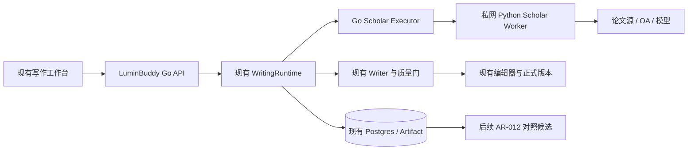

# 研究综述路径：技术设计

状态：拟实施设计。需求见 [requirements.md](requirements.md)，接口见 [contracts.md](contracts.md)，开发顺序见 [实施计划](../../docs/plans/2026-09-07-research-review-integration.md)。路径均相对 OSS 仓库根目录，商业版对应同名路径。

## 1. 已核实的基础与缺口

| 现有位置 | 当前行为 | 本方案处理 |
|---|---|---|
| backend/internal/writingplan/templates.go | 每个 mode 一个模板；strict_research 为检索/提纲/正文/事实/证据/质量/提交 | 新增独立 research_review 模板 |
| backend/internal/writingruntime/material_adapter.go | SourceRecord 只有 source_id/title/url/excerpt/score | 新增 ResearchEvidencePack；SourcePack 只做兼容投影 |
| backend/internal/writingruntime/orchestrator.go | human_gate 暂停并写 UnsafeInFlight；没有消费确认产物的分支 | 实现独立的待确认状态与持久决议，不复用 unsafe recovery |
| backend/internal/writingruntime/recovery.go | UnsafeInFlight 会要求人工恢复；成功 attempt 可恢复完成节点 | gate 确认事务写成功记录/产物；恢复识别同一 gate 决议 |
| backend/internal/server/handlers_writing_run.go | /approve 确认计划/权限；/resume 恢复运行 | 新增 gate 确认 API，不挪用 /approve |
| backend/internal/server/governed_runners.go | 旧 outline 包装器依赖约 1 秒超时自动确认 | 研究提纲只负责生成，由新 gate 确认 |
| backend/internal/server/governed_runtime.go | 注册 action/validate 的 LegacyExecutorAdapter | 学术节点直接实现 runtime executor；gate 由编排器处理 |
| frontend/src/stores/writing-runtime-store.ts | 事件驱动投影，按 sequence 去重 | 加研究进度和 gate 数据；GET 作为持久状态依据 |

上述代码能提供宿主，但不是已实现学术工作流。既有真实 HTTP E2E 曾出现 worker 已暂停、轮询未看到终态的问题，定位与修复列为 T00，上线前置；本次不推断其根因已确定。

## 2. 架构边界

- Go 持有用户/文档/合同/计划/运行/审批/预算/最终产物；Python 仅执行有界计算和外部查询，不再持有产品项目数据库。
- 新增 `services/scholar-worker/`（Python 3.12；版本锁定在实现提交）。上游 PR #6/#7 仅有 pyproject 的 `Proprietary` 声明（无 LICENSE 文件、无版权人、无授权条款），截至本方案未取得书面许可：T03 先以自有协议与 mock 实现落地，不复制上游代码；取得许可后另行评估模块复用并重估工作量。即使复用也必须重写加固——PR #7 下载仅有 scheme 校验并盲目跟随重定向（无 DNS/IP/私网地址防护），去重为单键 DOI-or-title，均弱于本方案 §9 与 R03 的要求。
- Go 调用 Python 的短任务：一次 query、一次语义筛选批次、一次全文获取、一次解析、一次论文阅读。首版不创建远端全程异步 review job，不用同步 650 秒请求扮演 durable queue。
- 子任务进度由 Go 的 `writing_research_tasks` 持久表持有。Python 无长期产品任务队列；HTTP 断开尝试取消底层请求，但已被上游接收的模型调用可能继续计费，Go 标记 outcome_unknown，用户决定是否重试。
- 正文继续用当前模型配置与 Writer，只增加专用证据输入适配；不在方案中固化或复制任何 API key。

## 3. 合同与计划

新增 `WritingContract.Research *ResearchSpec`，JSON `research,omitempty`；仅研究综述使用 `schema_version=lcp/1.1`，旧合同仍严格按 `lcp/1.0` 校验。新增 `specs/lcp/v1.1/writing-contract.schema.json`；已有 v1 schema 不改写成接受新字段。

Go 解码/Validate 按版本分支，旧字段序列化顺序不变，新字段放尾部并 omitempty；测试历史合同 JSON 与 ComputeHash 完全不变。新模式只允许 v1.1 + research 非空，所有默认值在确认前填实；年份、数量、证据范围不能作为未入哈希的运行时隐式配置。研究问题取 contract.content.central_question，不复制第二份可分歧的真值。

Compiler、前后端枚举、字段来源校验、JSON Schema、合同编辑/确认都要同步；auto 不推荐新模式。未开启研究功能、能力未激活、Reader/Writer 不支持所需输入时 compile fail closed。

### 固定节点表

| 节点 ID | kind / capability class（新增类以 research. 开头） | 输入 → 输出 |
|---|---|---|
| research_discover | action / research.discover | contract,materials → research_candidates |
| research_read | action / research.read | contract,research_candidates,materials → research_evidence_pack |
| gate_evidence | human_gate / research.gate.evidence | research_evidence_pack → evidence_approval |
| research_outline | action / research.outline | contract,research_evidence_pack,evidence_approval → research_outline |
| gate_outline | human_gate / research.gate.outline | research_outline → approved_research_outline |
| research_draft | action / research.draft | contract,research_evidence_pack,evidence_approval,approved_research_outline → full_draft,research_citation_index |
| research_citations | validate / research.validate.citations | research_evidence_pack,full_draft,research_citation_index → evidence_report,research_validation_details |
| research_fact | validate / research.validate.fact | research_evidence_pack,full_draft → fact_report |
| quality | validate / validation.quality | full_draft,evidence_report,fact_report → quality_report |
| finalize | action / document.finalize | full_draft,quality_report → revision_set |

每个节点显式依赖提供其输入的上游节点：discover 无依赖；read→discover；gate_evidence→read；outline→read,gate_evidence；gate_outline→outline；draft→read,gate_evidence,gate_outline；citations→read,draft；fact→read,draft；quality→draft,citations,fact；finalize→draft,quality。首版 citations 与 fact 仍按就绪顺序串行调度。首版顺序执行，不把 NodeMap/Parallel 枚举的存在当成动态分片已经实现。新 capability ID 用 `core.` + 新增 class，版本 1；已有 quality 为 class `validation.quality` / ID `core.validation.quality`，finalize 为 class `document.finalize` / ID `core.document.finalize`。gate manifest 无外部调用权限，由内核处理，编译校验允许其受控无 executor 分支；不能以虚构 runner 绕过注册校验。无 executor 例外仅允许这两个明确的 kernel-owned gate ID、NodeHumanGate 和预设 I/O；manifest.Validate、compile、ValidateForDispatch、runtime 恢复均执行相同校验，不能给任意外部 manifest 开通免授权通道。

`research_read` 内部按候选逐项处理并持久化子任务，整节点重试只复用校验通过的子任务产物。MaxItems=20，MaxConcurrency=1；下载/阅读单次超时分别建议 60/180 秒，research_read 节点上限 20 分钟，整个主动执行预算 30 分钟。这些是首版默认配置，要同时进入 manifest 上限、template bounds 与 plan budget 校验，不能只改 HTTP timeout。20 篇是数量上限，不保证在预算内全部完成；到达预算边界保存进度并暂停评估：若可用可引用来源已达 min_citable_sources，携带部分包（未完成项明确标记）进入 evidence gate 由用户决定；不足则按 INSUFFICIENT_EVIDENCE 暂停。首版不新增"扩预算审批 gate"；上调数量/预算走新合同版本 + 新运行（按输入哈希复用缓存），不能后台无限续跑。默认 max_papers 取 10（合同上限仍 20），使默认 30 分钟预算大概率覆盖单次运行。

## 4. 证据存储与引用

ResearchEvidencePack 是独立 Artifact 类型，内容通过现有 ContentGateway/Artifact 内容表写入。原始文件与解析块也作为内容寻址的 Artifact 保存；worker 只能得到当前任务允许的文件字节或短期内网内容授权，不能接受任意本机路径。

每篇论文保存来源别名和 DOI、选取理由、阅读范围、解析覆盖；每条证据保存文档/文本块哈希、原文 quote、Unicode code point 的起止偏移。Go 和 Python 用相同 UTF-8 内容哈希与码点区间测试。页码可为空，不能给 TXT/摘要伪造 PDF 页码。

阅读卡中的 claim 分 source_assertion / interpretation / hypothesis；前者必须有有效 evidence 绑定，后两者不能自动升级为论文事实。使用者确认整个证据包只代表允许写作，不把所有 claim.review_status 改成事实已核验。

论文全文/摘要属不可信外部文本：在所有模型提示中一律按数据框定（明确分隔与长度上限），Reader 输出仅作为带来源的材料，不触发工具执行、不覆盖系统指令；由此产生的 claim 仍按 claim.kind 与 review_status 流转。

冻结 = 内容入库并得到哈希，而不是改写 JSON 中一个 frozen 布尔值。确认对象是 Artifact ID/version/hash。修改任何材料/claim 产生新包、新 hash、新确认；旧正文引用仍可指向旧包。跨用户不能通过猜 hash 读取文件。

SourcePack 投影只给兼容层；不能丢掉详细 pack 后再把普通摘录当可追溯证据。新研究 Writer adapter 同时读取 pack，构建有界证据上下文，并记录实际送入模型的 evidence ID 清单。上下文溢出按主题保留证据，输出 omitted IDs/原因；关键章节无证据时暂停，不能静默删除绑定。

正文使用稳定引用标记 `[@ev_<id>]`，提交时解析生成文献表及引用索引；显示可编号，但内部不以易漂移的 [1] 作为唯一绑定。同一句多个证据允许多标记。质检校验有效 ID、来源范围、引用位置、失效 hash；语义支持检查另出待核查结论，不能以字符串匹配替代真实性判断。

## 5. Gate 与恢复机制

新增 waiting_gate 的持久记录，运行外部状态仍 paused（reason=awaiting_evidence/awaiting_outline），不新增破坏既有状态机的顶层状态值。pause reason 沿用现有机制写入 run.transitioned 事件的 reason_code，不新增 writing_runs 列。

1. 到达 gate：同一数据库事务创建 pending gate、保存 checkpoint（新增 waiting_gate_id，不能放 UnsafeInFlight）、写 paused 状态和事件。
2. 确认：同一事务核验 actor ownership、当前 run/plan/hash、gate revision、输入 Artifact hash；保存 decision 和批准产物，将 gate 对应完成记录持久化，更新 checkpoint，写事件与待恢复标识。幂等重发返回同一结果。现有代码中 NodeHumanGate 没有任何完成路径（含 gate 的 plan 主循环不会退出），本条为纯新增机制；T02 验收含"决议后该节点恰好完成一次、主循环正常退出"用例。
3. worker 仅在数据库事务提交后恢复；恢复调度信息必须持久化并可被找回，不能只投内存 channel。注意现有 DispatchableRunIDs 只扫 planned/running/pausing/cancelling（不含 paused）：要么扩展扫描覆盖"已决议待恢复"的 run，要么决议事务提交后投递持久恢复标记并经 API/触发器恢复。GET 立刻可见决议，即使 worker 尚未运行。
4. 普通 resume 遇未确认 gate 返回 `GATE_APPROVAL_REQUIRED`；gate 确认 API 不代替计划权限审批。
5. outline gate 可先保存 edited outline Artifact，重新验证它引用的证据与 pack hash，再确认新版本。提交过期 revision 返回 409；已开始正文后不能回写这个 gate。
6. 拒绝或补充证据不在旧运行修改输入：保留 paused，用户创建新合同/运行或取消旧运行；不自动重跑产生费用。

## 6. 子任务持久化

新增迁移（预留编号 107，开工时检查两仓库是否冲突）。除建表外还需扩展既有 CHECK 约束，否则 lcp/1.1 合同与 gate 节点无法入库：writing_contracts.schema_version 允许 lcp/1.1（089 行66）、writing_node_attempts.node_kind 增加 human_gate（091 行46）、writing_run_events.event_type 增加新事件类型（091/095）：

- `writing_research_tasks`: id, owner_user_id, run_id, node_id, task_key, phase, input_hash, status, attempt, lease_owner, lease_expires_at, output_artifact_id, output_hash, error_code, retry_after, usage_json, created_at, updated_at；UNIQUE(run_id,node_id,task_key,input_hash)。
- `writing_gate_decisions`: gate_id, run_id, node_id, plan_id, plan_version, plan_hash, input_artifact_id, input_hash, revision, status, decision_artifact_id, actor_id, idempotency_key, decided_at；UNIQUE(run_id,node_id,plan_version)，幂等键限 owner+operation，并保存 request hash。
- checkpoint 扩展 waiting_gate_id；若现有 checkpoint 存 JSON，先保持旧版本可读并加版本分支。gate 决议与 checkpoint 同事务要求实现 store-backed 事务入口，不能拼接多个独立 Save 调用。

task_key 为 phase+论文身份或 query 序号；input_hash 包含研究问题/筛选政策版本、原始内容 hash、模型/provider、prompt、Reader/parser版本、块选择策略；筛选与解析可分别构造最小充分缓存键。首次仅同 owner 内复用，不做跨租户全局缓存。

所有租约更新带 fencing token/版本条件；租约过期的旧 worker 不能提交覆盖新任务结果。已完成产物 hash 校验失败则重新解析或转人工处理；LLM in-flight 结果未知不自动归类 safe。

## 7. 错误与费用

| 情况 | 行为 |
|---|---|
| 单个论文源不可用 | 标记该源错误，其他源继续；所有源失败时暂停，不报“检索无结果” |
| OA 无全文/HTML/扫描件 | 可按合同降级摘要；full_text_required 时该篇不可进入可用证据数 |
| 无相关来源或不足阈值 | INSUFFICIENT_EVIDENCE 暂停，保留候选与缺口 |
| 429 | 尊重 Retry-After、有上限退避；跨该 provider 的调用限速，不能只依赖单 LLMClient 间隔 |
| 上游明确拒绝/超时结果未知 | 明确拒绝按错误类别处理；未知标 outcome_unknown，显示重试可能重复计费 |
| 用户暂停/取消 | 不再调度新子任务，传播 context；已获结果仅作中间产物，不自动提交文档 |
| 引用伪造/hash 失效 | EVIDENCE_INVALID，阻止正式提交；保留候选以便修订 |
| worker/模型不可用 | SERVICE_UNAVAILABLE，研究路径暂停，普通路径继续可用 |

每次模型调用记录 provider/model/tokens/耗时/请求关联 ID；费用未知标 usage_unknown。预算在发起每次子任务前预留，结果后结算；未知结果保留预留，禁止重启后预算归零。人工等待时间不消耗执行耗时预算，但租约和后台清理照常执行。对没有可信单价的模型，使用 token/调用次数硬上限并展示费用未知；若合同强制美元预算而无法建立费用上界，则阻止调用，不能声称美元预算已被严格执行。

## 8. AR-012 后续接入

先参数化 ResearchSpec/章节/语言/长度/来源门槛，移除领域硬编码；增加 Reader claims/locators 的输入适配，不能仅将摘要重命名为 REVIEW_CORPUS。

候选幂等键 = owner + contract_hash + evidence_pack_hash + approved_outline_hash + generator/prompt/model版本 + mode。使用每次输入独立目录，checkpoint 验证输入 hash；请求超时通过持久状态对账，新增取消/租约机制后才可接长期生成。

首轮仅 compare/shadow：相同证据和要求下比较现有 Writer 与 AR-012，候选存在独立 Artifact，不能调用 finalize 或修改正式版本。对照至少 12 个案例（3 学科 × 2 材料充分度 × 2 种长度），盲评论点组织、引用支持、校准表达、可读性、成本/耗时。引用完整性必须 100%；若关键无支持主张增多，不因文风分更高而上线。人评收益达到团队预先锁定的目标且成本可接受后，再增加用户可选生成器。

## 9. 部署与许可

首版新增 `RESEARCH_REVIEW_ENABLED=false`、`SCHOLAR_WORKER_URL`、服务间认证密钥配置项；名称为拟新增。使用现有 runtime allowlist，只对测试用户启用新路径；不直接全局开启运行时。

worker 私网部署，非 root、限制内存/临时空间、禁止任意命令和路径输入。下载校验 DNS/IP 与每次重定向，拒绝 loopback/private/link-local/metadata 等地址，限制跳转数/文件大小/内容类型；网络连接目标也需受约束，不能只做 URL 正则。

数据迁移仅增量建表，不重写历史合同；回滚先关闭新路径入口，停止新任务并有序处理在途任务，保留新表/证据/决议供读取和恢复，不能直接 down 删除用户证据。旧版本不认识 lcp/1.1 时不得拿旧二进制继续执行新运行；先 drain/pause 并保留兼容读取服务。

上游快照：AR-012 `68888a75719776eab58c5e01a3ad320a37c20abc`；PR6 `9e4fa1d5c0df63c7c68024c965e9a28db6a0733a`；PR7 `acc106ba123c73614d5316a8f2cda714094e00ce`。参考仓库位于工作区 references/。PR1–7 合并核查见工作区 output/autoresearch-ar012-analysis/AutoResearch_PR1-7_合并核查与写作流接入分析_2026-09-07.md；这些 PR 的 head 均不是 AR-012 已合入功能，不能直接声明组合已验证。
